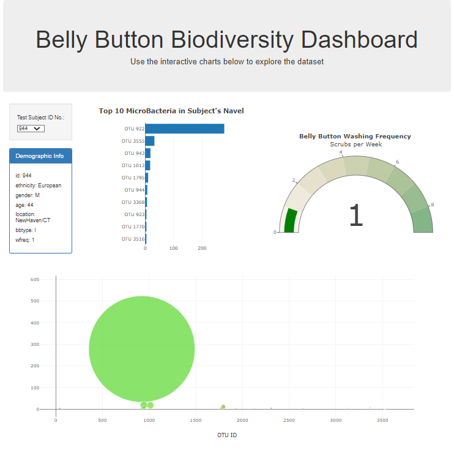
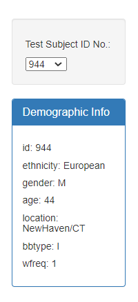
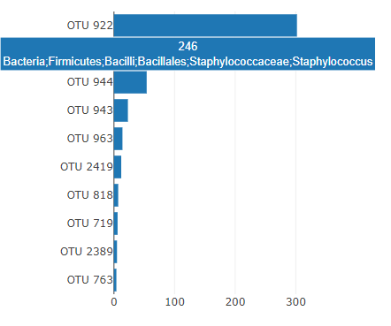
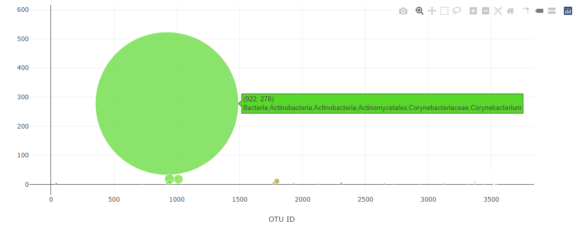

# Examining the biodiversity of the humble human navel

For this assignment, an interactive dashboard was built to explore the Belly Button Biodiversity dataset (http://robdunnlab.com/projects/belly-button-biodiversity/) which catalogoues the microbes that colonise human navels. 

This project was launched to examine the microbes that call our navels home and investigate the factors that might affect their ability to survive and thrive in such environments. Subjects who donated samples to this study were based in North America.

It revealed that a small handful of microbial species (also called operational taxonomic units, or OTUs, in the study) were present in more than 70% of the people who participated in the project, while the rest are relatively rare.

## Introducing the dashboard's functions

Link to Dashboard: https://shanch3n.github.io/belly-button-challenge/

### Primary visualisations

The Plotly D3 Javascript library was used to create 3 separate visualisations for each participant:
1. A horizonal bar chart dislaying the ten most prevalent OTUs in a sample
2. A bubble chart of all the OTUs in the sample
3. A gauge charts of a subject's wash frequency

### Begin by selecting a subject's ID

A subject's can be selected from a dropdown menu via their ID No. 

Their demographical information, such as Ethnicity, Gender, Age, Location, Body Type (bbtype), and Frequency of Washes (wfreq), is presented in a panel below the dropdown.

### Hover for more information about each microbial species (OTU)

Both the bar and bubble charts provide further information about each microbial species present in the respective sample, such as their scientific name. These can be accessed by hovering the bar or bubble associated with a particular OTU.

All 3 charts update any time a new subject's sample is selected.

## Resources
- Javascript
- D3.js
- Plot.ly (https://plotly.com/javascript/)
- HTML

## Acknowledgements
Hulcr, J. et al.(2012) A Jungle in There: Bacteria in Belly Buttons are Highly Diverse, but Predictable. Retrieved from: http://robdunnlab.com/projects/belly-button-biodiversity/results-and-data/

